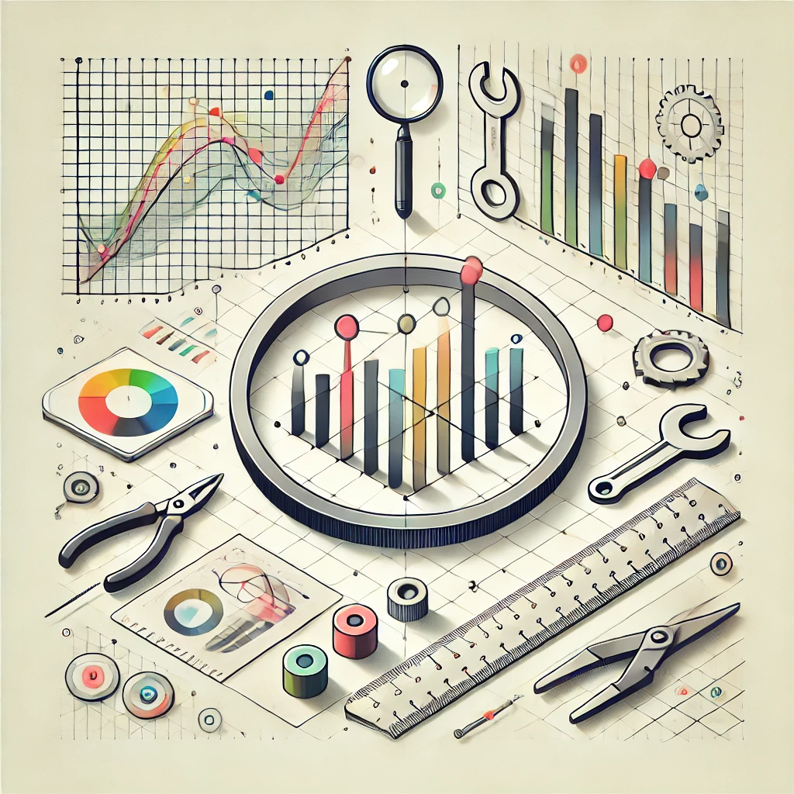

# Plot Tools

<figure>
        
        <figcaption></figcaption>
    </figure>

A collection of plot tools, like python matplotlib, R ggplot2, etc.

- [python](python/README.md)
- [R](r/README.md)
